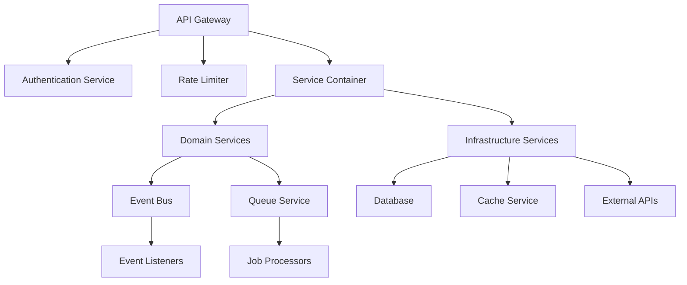
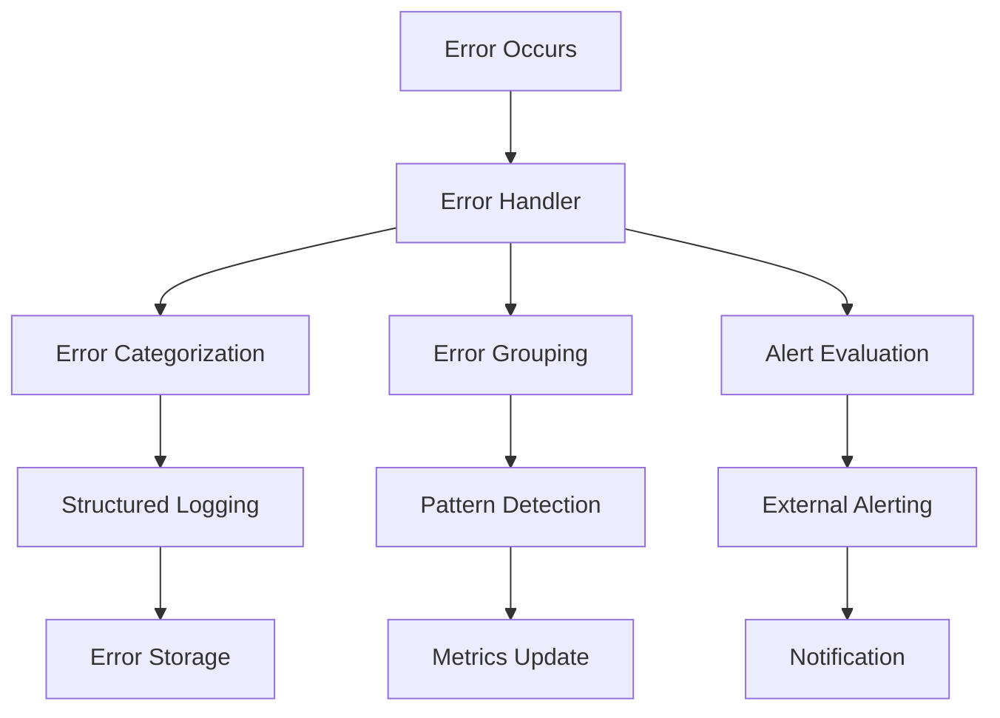

# Mikrotik Billing System - Enterprise Architecture Documentation

## 📋 Table of Contents

1. [Overview](#overview)
2. [Architecture Principles](#architecture-principles)
3. [Core Components](#core-components)
4. [Design Patterns](#design-patterns)
5. [Component Integration](#component-integration)
6. [Security Architecture](#security-architecture)
7. [Performance & Scalability](#performance--scalability)
8. [Monitoring & Observability](#monitoring--observability)
9. [Error Handling & Resilience](#error-handling--resilience)
10. [Testing Strategy](#testing-strategy)
11. [Deployment Architecture](#deployment-architecture)
12. [Configuration Management](#configuration-management)
13. [Best Practices](#best-practices)

---

## 🎯 Overview

The Mikrotik Billing System is built on a **modern, enterprise-grade architecture** that emphasizes scalability, reliability, and maintainability. This document provides a comprehensive overview of the architectural components, design patterns, and integration strategies used throughout the system.

### Key Architectural Goals

- **High Availability**: Ensure 99.9% uptime with minimal downtime
- **Scalability**: Handle 10,000+ concurrent users horizontally
- **Security**: Enterprise-grade security with defense-in-depth
- **Observability**: Complete visibility into system behavior
- **Maintainability**: Clean, testable, and extensible codebase
- **Performance**: Sub-second response times for critical operations

### Technology Stack

```
Frontend Layer:
├── HTML5, CSS3, JavaScript (ES2022)
├── Bootstrap 5, HTMX
├── Chart.js for visualizations
└── Responsive design

Backend Layer:
├── Node.js 18+ (Fastify framework)
├── PostgreSQL (Primary + Read Replicas)
├── Redis (Caching & Queues)
├── RouterOS API Integration
└── WhatsApp Web JS

Architecture Layer:
├── Domain-Driven Design (DDD)
├── Event-Driven Architecture
├── Circuit Breaker Pattern
├── Distributed Tracing
├── API Gateway with Rate Limiting
└── Comprehensive Error Handling
```

---

## 🏗️ Architecture Principles

### 1. **Domain-Driven Design (DDD)**

The system follows DDD principles with clear separation of concerns:

```
src/
├── domains/
│   ├── billing/          # Billing domain logic
│   ├── customers/        # Customer management
│   ├── vouchers/          # Voucher system
│   ├── pppoe/             # PPPoE user management
│   ├── payments/          # Payment processing
│   ├── notifications/     # Notification system
│   └── infrastructure/    # Shared infrastructure
├── application/           # Application services
├── infrastructure/         # Technical infrastructure
└── interfaces/            # External interfaces
```

### 2. **Event-Driven Architecture**

Loose coupling through event-driven communication:

```javascript
// Example: Domain Event Flow
Customer Created → Billing Event → Notification Event
     ↓                ↓                ↓
Customer Service → Billing Service → Notification Service
```

### 3. **Circuit Breaker Pattern**

Resilience through circuit breakers for external dependencies:

```javascript
// Mikrotik API with Circuit Breaker
const result = await circuitBreaker.execute('mikrotik-api', async () => {
  return await mikrotikAPI.getActiveUsers();
});
```

### 4. **Distributed Tracing**

End-to-end request tracing across all services:

```javascript
// Trace Flow Example
Request → API Gateway → Service Layer → Database → Response
   ↓           ↓              ↓           ↓
Trace ID → Span 1 → Span 2 → Span 3 → Response Time
```

---

## 🔧 Core Components

### 1. **Enhanced Service Container**

```javascript
class EnhancedServiceContainer {
  // Factory pattern with dependency injection
  // Circular dependency detection
  // Service lifecycle management
  // Health monitoring
}
```

**Features:**
- Factory-based service creation
- Automatic dependency resolution
- Circular dependency detection
- Service health monitoring
- Graceful shutdown

### 2. **API Gateway**

```javascript
class APIGateway {
  // Centralized API management
  // Rate limiting & security
  // Request routing & versioning
  // Request/response transformation
}
```

**Features:**
- Centralized request routing
- Rate limiting per user type
- Authentication & authorization
- Request validation & sanitization
- Response caching
- Distributed tracing integration

### 3. **Circuit Breaker Manager**

```javascript
class CircuitBreakerManager {
  // Global circuit breaker management
  // Health monitoring
  // Automatic recovery
  // Performance metrics
}
```

**Features:**
- Centralized circuit breaker management
- Service health monitoring
- Automatic failover
- Performance metrics
- Configurable thresholds

### 4. **Event Bus**

```javascript
class EventBus {
  // Domain event communication
  // Event persistence
  // Retry mechanisms
  // Event sourcing
}
```

**Features:**
- Event persistence & replay
- Retry with exponential backoff
- Event sourcing capabilities
- Cross-domain communication
- Performance monitoring

### 5. **Enhanced Queue Service**

```javascript
class EnhancedQueueService {
  // Priority-based job processing
  // Scheduled jobs (cron)
  // Job dependencies
  // Batch processing
}
```

**Features:**
- Priority-based job processing
- Scheduled/cron jobs
- Job dependencies
- Batch processing
- Dead letter queue management

### 6. **Advanced Monitoring Service**

```javascript
class AdvancedMonitoringService {
  // Prometheus metrics
  // Performance monitoring
  // Business metrics
  // Alerting
}
```

**Features:**
- Prometheus metrics integration
- Real-time performance monitoring
- Business metrics tracking
- Automated alerting
- Health check management

### 7. **Comprehensive Error Handler**

```javascript
class ComprehensiveErrorHandler {
  // Centralized error management
  // Error tracking & grouping
  // Structured logging
  // Alert integration
}
```

**Features:**
- Centralized error management
- Error grouping & pattern detection
- Structured logging
- Integration with external alerting services
- Performance impact monitoring

### 8. **API Version Manager**

```javascript
class APIVersionManager {
  // API versioning strategy
  // Backward compatibility
  - Migration support
  // Deprecation management
}
```

**Features:**
- Multiple versioning strategies
- Backward compatibility
- Automatic migration
- Deprecation warnings
- Version lifecycle management

---

## 🎨 Design Patterns

### 1. **Repository Pattern**

```javascript
class CustomerRepository {
  async findById(id) { /* Implementation */ }
  async save(customer) { /* Implementation */ }
  async delete(id) { /* Implementation */ }
}
```

### 2. **Service Locator Pattern**

```javascript
// Service registration
serviceContainer.registerFactory('customerService', (container, deps) => {
  return new CustomerService(container.config.customers);
});

// Service resolution
const customerService = serviceContainer.get('customerService');
```

### 3. **Observer Pattern**

```javascript
// Event-driven communication
eventBus.subscribe('payment.completed', (event) => {
  notificationService.sendPaymentConfirmation(event);
});
```

### 4. **Factory Pattern**

```javascript
class ServiceFactory {
  static createBillingService(config) {
    return new BillingService(config);
  }
}
```

### 5. **Decorator Pattern**

```javascript
// Request tracing decorator
const tracedHandler = errorHandler.wrap(handler, {
  context: { operation: 'customer_creation' }
});
```

---

## 🔗 Component Integration

### Service Communication Flow



### Request Processing Flow

1. **Request Reception**: API Gateway receives and validates request
2. **Authentication**: JWT token validation and user context creation
3. **Rate Limiting**: Apply per-user rate limiting rules
4. **Service Resolution**: Resolve required services from container
5. **Business Logic**: Execute domain business logic
6. **Event Publishing**: Publish domain events for async processing
7. **Response**: Return formatted response with appropriate headers

### Error Handling Flow



---

## 🔒 Security Architecture

### Defense in Depth

```
┌─────────────────────────────────────────────────────────────┐
│                    Security Layers                          │
├─────────────────────────────────────────────────────────────┤
│ 1. Network Security (WAF, DDoS Protection)                │
│ 2. API Gateway (Rate Limiting, Authentication)              │
│ 3. Application Security (Input Validation, Authorization)    │
│ 4. Data Security (Encryption at Rest & Transit)            │
│ 5. Infrastructure Security (Container Security, Secrets)      │
└─────────────────────────────────────────────────────────────┘
```

### Authentication & Authorization

```javascript
// JWT-based authentication
const token = jwt.sign(payload, secret, {
  expiresIn: '24h',
  issuer: 'mikrotik-billing',
  audience: 'api-users'
});

// Role-based authorization
const permissions = {
  admin: ['read', 'write', 'delete', 'manage'],
  operator: ['read', 'write'],
  viewer: ['read']
};
```

### Data Protection

```javascript
// Encryption at rest
const encrypted = crypto.encrypt(data, encryptionKey);

// Encrypted API communication
const signature = crypto.createHmac('sha256', signingKey)
                      .update(requestBody)
                      .digest('hex');
```

---

## ⚡ Performance & Scalability

### Performance Optimizations

1. **Database Optimization**
   - Connection pooling with read replicas
   - Query optimization and indexing
   - Multi-level caching strategy

2. **Caching Strategy**
   ```javascript
   // Multi-level caching
   Cache L1: In-memory (fastest)
   Cache L2: Redis (fast)
   Cache L3: Database (persistent)
   ```

3. **Async Processing**
   - Background job processing
   - Event-driven architecture
   - Non-blocking I/O operations

### Scalability Patterns

```javascript
// Horizontal scaling with load balancing
const scaling = {
  api: {
    minInstances: 2,
    maxInstances: 10,
    targetCPU: 70,
    targetMemory: 80
  },

  workers: {
    queueProcessors: 5,
    backgroundJobs: 3,
    notifications: 2
  },

  database: {
    primary: 1,
    readReplicas: 3,
    sharding: 'customer_id'
  }
};
```

### Performance Metrics

```javascript
// Key performance indicators
const kpis = {
  responseTime: {
    target: '< 500ms',
    p95: '< 1000ms',
    p99: '< 2000ms'
  },

  throughput: {
    requestsPerSecond: 1000,
    transactionsPerMinute: 5000
  },

  availability: {
    target: '99.9%',
    mttr: '< 5 minutes'
  }
};
```

---

## 📊 Monitoring & Observability

### Monitoring Stack

```
┌─────────────────────────────────────────────────────────────┐
│                   Observability Stack                       │
├─────────────────────────────────────────────────────────────┤
│ Metrics: Prometheus + Grafana                               │
│ Logging: Structured JSON + ELK Stack                        │
│ Tracing: Jaeger + OpenTelemetry                             │
│ Alerts: AlertManager + PagerDuty                             │
│ Health Checks: Custom + Kubernetes                           │
└─────────────────────────────────────────────────────────────┘
```

### Key Metrics

```javascript
// Business metrics
const businessMetrics = {
  customers: {
    total: 15000,
    active: 8500,
    newToday: 45
  },

  revenue: {
    daily: 5000000,
    monthly: 150000000,
    growth: 12.5
  },

  operations: {
    vouchersCreated: 250,
    paymentsProcessed: 180,
    notificationsSent: 350
  }
};

// Technical metrics
const technicalMetrics = {
  system: {
    cpu: 65,
    memory: 78,
    disk: 45
  },

  application: {
    errorRate: 0.2,
    responseTime: 450,
    throughput: 850
  },

  database: {
    connections: 45,
    queryTime: 120,
    slowQueries: 2
  }
};
```

### Alerting Rules

```yaml
groups:
  - name: critical
    rules:
      - alert: HighErrorRate
        expr: error_rate > 0.05
        for: 2m
        labels:
          severity: critical

      - alert: HighResponseTime
        expr: response_time_p95 > 2000
        for: 5m
        labels:
          severity: warning

  - name: business
    rules:
      - alert: PaymentFailure
        expr: payment_failure_rate > 0.1
        for: 1m
        labels:
          severity: critical
```

---

## 🛡️ Error Handling & Resilience

### Error Classification

```javascript
const errorCategories = {
  SYSTEM: 'system_error',
  BUSINESS: 'business_error',
  NETWORK: 'network_error',
  DATABASE: 'database_error',
  AUTHENTICATION: 'authentication_error',
  VALIDATION: 'validation_error',
  EXTERNAL: 'external_service_error',
  TIMEOUT: 'timeout_error'
};
```

### Resilience Patterns

1. **Circuit Breaker**: Prevent cascade failures
2. **Retry with Backoff**: Handle transient failures
3. **Timeout Protection**: Prevent hanging operations
4. **Graceful Degradation**: Fallback functionality
5. **Bulkhead Isolation**: Isolate component failures

### Error Recovery Strategies

```javascript
// Circuit breaker with fallback
const result = await circuitBreaker.execute('external-api', async () => {
  return await externalAPI.getData();
}, {
  fallbackFunction: async (error) => {
    // Return cached data or default response
    return await cache.get('external-api-cache') || defaultResponse;
  }
});
```

---

## 🧪 Testing Strategy

### Testing Pyramid

```
                /\
               /  \
              /____\
             / E2E  \  ← 10% (End-to-End Tests)
            /________\
           / Integration\ ← 30% (Integration Tests)
          /____________\
         /   Unit Tests   \ ← 60% (Unit Tests)
        /________________\
```

### Test Categories

```javascript
// Unit Tests
describe('Billing Service', () => {
  test('should calculate correct tax amount', () => {
    const billing = new BillingService();
    const tax = billing.calculateTax(100000);
    expect(tax).toBe(11000); // 11% tax
  });
});

// Integration Tests
describe('Payment Flow', () => {
  test('should process payment end-to-end', async () => {
    const result = await paymentService.processPayment(paymentData);
    expect(result.status).toBe('completed');
  });
});

// E2E Tests
describe('Customer Registration Flow', () => {
  test('should register customer and create subscription', async () => {
    await page.goto('/register');
    await page.fill('#name', 'John Doe');
    await page.fill('#email', 'john@example.com');
    await page.click('#register');
    await expect(page.locator('.success-message')).toBeVisible();
  });
});
```

### Test Configuration

```javascript
// test-config.js
module.exports = {
  unit: {
    timeout: 5000,
    retries: 0,
    parallel: true,
    coverage: {
      threshold: 80,
      include: ['src/domains/**'],
      exclude: ['src/test/**']
    }
  },

  integration: {
    timeout: 30000,
    retries: 2,
    parallel: false,
    database: 'test',
    cleanup: true
  },

  e2e: {
    timeout: 60000,
    retries: 1,
    parallel: false,
    browser: 'chromium',
    headless: true
  }
};
```

---

## 🚀 Deployment Architecture

### Container Architecture

```dockerfile
# Multi-stage build
FROM node:18-alpine AS builder
WORKDIR /app
COPY package*.json ./
RUN npm ci --only=production

FROM node:18-alpine AS runtime
WORKDIR /app
COPY --from=builder /app/node_modules ./node_modules
COPY . .
EXPOSE 3000
CMD ["node", "src/app-architectured.js"]
```

### Kubernetes Deployment

```yaml
apiVersion: apps/v1
kind: Deployment
metadata:
  name: mikrotik-billing-api
spec:
  replicas: 3
  selector:
    matchLabels:
      app: mikrotik-billing-api
  template:
    metadata:
      labels:
        app: mikrotik-billing-api
    spec:
      containers:
      - name: api
        image: mikrotik-billing:latest
        ports:
        - containerPort: 3000
        env:
        - name: NODE_ENV
          value: "production"
        resources:
          requests:
            memory: "256Mi"
            cpu: "250m"
          limits:
            memory: "512Mi"
            cpu: "500m"
        livenessProbe:
          httpGet:
            path: /health
            port: 3000
          initialDelaySeconds: 30
          periodSeconds: 10
        readinessProbe:
          httpGet:
            path: /ready
            port: 3000
          initialDelaySeconds: 5
          periodSeconds: 5
```

### CI/CD Pipeline

```yaml
# .github/workflows/deploy.yml
name: Deploy to Production
on:
  push:
    branches: [main]

jobs:
  test:
    runs-on: ubuntu-latest
    steps:
      - uses: actions/checkout@v3
      - uses: actions/setup-node@v3
        with:
          node-version: '18'
      - run: npm ci
      - run: npm run test:unit
      - run: npm run test:integration
      - run: npm run test:e2e

  build:
    needs: test
    runs-on: ubuntu-latest
    steps:
      - uses: actions/checkout@v3
      - uses: docker/setup-buildx-action@v2
      - uses: docker/login-action@v2
        with:
          username: ${{ secrets.DOCKER_USERNAME }}
          password: ${{ secrets.DOCKER_PASSWORD }}
      - run: docker build -t mikrotik-billing:${{ github.sha }} .
      - run: docker push mikrotik-billing:${{ github.sha }}

  deploy:
    needs: build
    runs-on: ubuntu-latest
    steps:
      - uses: azure/k8s-deploy@v1
        with:
          kubeconfig: ${{ secrets.KUBE_CONFIG }}
          manifests: k8s/
          images: mikrotik-billing:${{ github.sha }}
```

---

## ⚙️ Configuration Management

### Environment Configuration

```javascript
// config/environments/production.js
module.exports = {
  serviceId: 'mikrotik-billing',
  environment: 'production',

  database: {
    host: process.env.DB_HOST,
    port: process.env.DB_PORT,
    database: process.env.DB_NAME,
    username: process.env.DB_USER,
    password: process.env.DB_PASSWORD,
    ssl: true,
    pool: {
      min: 5,
      max: 20,
      idleTimeoutMillis: 30000
    }
  },

  redis: {
    host: process.env.REDIS_HOST,
    port: process.env.REDIS_PORT,
    password: process.env.REDIS_PASSWORD,
    db: 0
  },

  security: {
    jwtSecret: process.env.JWT_SECRET,
    encryptionKey: process.env.ENCRYPTION_KEY
  },

  monitoring: {
    prometheus: {
      port: 9090,
      path: '/metrics'
    },
    alerts: {
      enabled: true,
      webhook: process.env.ALERT_WEBHOOK
    }
  }
};
```

### Feature Flags

```javascript
// config/features.js
module.exports = {
  enableNewBillingUI: process.env.FEATURE_NEW_BILLING_UI === 'true',
  enableWhatsAppV2: process.env.FEATURE_WHATSAPP_V2 === 'true',
  enableAdvancedReporting: process.env.FEATURE_ADVANCED_REPORTING === 'true',

  getFeature(featureName) {
    return this[featureName] || false;
  },

  isFeatureEnabled(featureName, userId = null) {
    // Logic for user-specific feature flags
    return this.getFeature(featureName);
  }
};
```

---

## 📚 Best Practices

### Code Quality

1. **Follow SOLID Principles**
   ```javascript
   // Single Responsibility
   class CustomerService {
     async createCustomer(data) { /* Only customer creation */ }
     async getCustomer(id) { /* Only customer retrieval */ }
   }

   // Dependency Inversion
   class PaymentService {
     constructor(paymentGateway) {
       this.gateway = paymentGateway;
     }
   }
   ```

2. **Use TypeScript for Type Safety**
   ```typescript
   interface Customer {
     id: string;
     name: string;
     email: string;
     balance: number;
     createdAt: Date;
   }

   class CustomerService {
     async createCustomer(data: Omit<Customer, 'id' | 'createdAt'>): Promise<Customer> {
       // Implementation
     }
   }
   ```

3. **Implement Proper Error Handling**
   ```javascript
   class ServiceError extends Error {
     constructor(message, code, statusCode = 500) {
       super(message);
       this.code = code;
       this.statusCode = statusCode;
     }
   }

   try {
     await riskyOperation();
   } catch (error) {
     if (error instanceof ServiceError) {
       throw error;
     }
     throw new ServiceError('Unexpected error', 'UNKNOWN_ERROR');
   }
   ```

### Security Best Practices

1. **Input Validation**
   ```javascript
   const { body, query } = request;

   // Validate and sanitize inputs
   const validatedData = await validationSchema.validate(body);
   const sanitizedQuery = sanitizeObject(query);
   ```

2. **Secure Database Queries**
   ```javascript
   // Use parameterized queries
   const result = await db.query(
     'SELECT * FROM customers WHERE email = $1',
     [email]
   );
   ```

3. **Environment Variable Security**
   ```bash
   # .env.example
   JWT_SECRET=your-super-secret-key
   ENCRYPTION_KEY=your-encryption-key
   DB_PASSWORD=your-database-password
   REDIS_PASSWORD=your-redis-password
   ```

### Performance Best Practices

1. **Database Optimization**
   ```javascript
   // Use indexes for frequently queried fields
   CREATE INDEX idx_customers_email ON customers(email);

   // Use pagination for large datasets
   const customers = await db.query(
     'SELECT * FROM customers LIMIT $1 OFFSET $2',
     [limit, offset]
   );
   ```

2. **Caching Strategy**
   ```javascript
   // Multi-level caching
   async getCustomer(id) {
     // L1: In-memory cache
     if (memoryCache.has(id)) {
       return memoryCache.get(id);
     }

     // L2: Redis cache
     const cached = await redis.get(`customer:${id}`);
     if (cached) {
       memoryCache.set(id, cached);
       return cached;
     }

     // L3: Database
     const customer = await db.query('SELECT * FROM customers WHERE id = $1', [id]);

     // Cache in both layers
     await redis.set(`customer:${id}`, customer, 300); // 5 minutes
     memoryCache.set(id, customer);

     return customer;
   }
   ```

3. **Async Processing**
   ```javascript
   // Process heavy operations in background
   app.post('/api/generate-report', async (req, res) => {
     const jobId = await queueService.add('reports', {
       type: 'monthly',
       date: req.body.date
     });

     res.json({ jobId, message: 'Report generation started' });
   });
   ```

### Testing Best Practices

1. **Test Coverage**
   ```javascript
   // Aim for 80%+ code coverage
   jest --coverage --coverageThreshold='{"lines":80}'
   ```

2. **Test Isolation**
   ```javascript
   // Use dependency injection for testability
   class CustomerService {
     constructor(database, notificationService) {
       this.db = database;
       this.notifications = notificationService;
     }
   }

   // Mock dependencies in tests
   const mockDB = new MockDatabase();
   const mockNotifications = new MockNotificationService();
   const service = new CustomerService(mockDB, mockNotifications);
   ```

3. **Test Data Management**
   ```javascript
   // Use fixtures for test data
   beforeEach(() => {
     jest.clearAllMocks();
     fixtures.load('customers');
   });
   ```

---

## 🔮 Future Enhancements

### Short-term (Next 3 months)

1. **GraphQL API**
   - Implement GraphQL schema
   - Apollo Server integration
   - Real-time subscriptions

2. **Advanced Analytics**
   - Real-time dashboard
   - Predictive analytics
   - Machine learning insights

3. **Mobile Application**
   - React Native mobile app
   - Offline capabilities
   - Push notifications

### Medium-term (3-6 months)

1. **Microservices Migration**
   - Split monolith into microservices
   - Service mesh implementation
   - Inter-service communication

2. **AI Integration**
   - Intelligent routing
   - Anomaly detection
   - Automated support

3. **Advanced Security**
   - Zero-trust architecture
   - Advanced threat detection
   - Compliance automation

### Long-term (6+ months)

1. **Cloud-Native Architecture**
   - Kubernetes orchestration
   - Service discovery
   - Auto-scaling

2. **Edge Computing**
   - CDN integration
   - Edge caching
   - Regional deployments

3. **Blockchain Integration**
   - Smart contracts for billing
   - Transparent transactions
   - Audit trail immutability

---

## 📞 Support & Contact

### Documentation

- **API Documentation**: `/api/docs`
- **Architecture Guide**: This document
- **Deployment Guide**: `/docs/deployment`
- **Troubleshooting**: `/docs/troubleshooting`

### Support Channels

- **Technical Support**: support@mikrotik-billing.com
- **Security Issues**: security@mikrotik-billing.com
- **Feature Requests**: features@mikrotik-billing.com

### Contributing

We welcome contributions! Please see `/CONTRIBUTING.md` for guidelines.

---

**Last Updated**: December 2024
**Version**: 2.0.0
**Architecture**: Enterprise-grade with DDD patterns